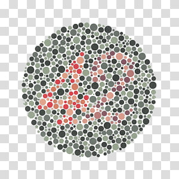

# Ishihara K-means

This project implements **K-Means Clustering from scratch** in Python to segment and extract the number embedded in **Ishihara color blindness test images**. It allows manual selection of the color cluster corresponding to the number region and highlights it in green.

---

## Project Description

Ishihara plates are designed to test color vision. This tool helps to automatically segment the plates using K-means clustering and lets users manually choose which color cluster best represents the number. It highlights the number in green and saves the result.

This implementation:
- Uses NumPy for mathematical operations
- Loads and saves images via Pillow
- Visualizes clusters using matplotlib
- Allows manual cluster selection for extraction

---

## Sample Inputs and Outputs

| Original Image | Extracted Number |
|----------------|------------------|
|  |  |
|    |    |
|  |  |
|  |  |

---

## How to Run

1. **Clone the repository:**
   ```bash
   git clone https://github.com/mennanoseer/ishihara-kmeans.git
   cd ishihara-kmeans
   ```

2. **Place Ishihara images in the `input_images/` folder.**
   Make sure they're named like `12.jpg`, `6.jpg`, etc.

3. **Run the program:**

   ```bash
   python ishihara_kmeans.py
   ```

4. **Follow the prompts:**

   * Enter the image number (e.g., `12`)
   * Choose the number of clusters (e.g., `10`)
   * Select which cluster(s) represent the number (e.g., `2, 5`)

5. **Check the `output_images/` folder** for the highlighted result.

---

## Dependencies

* `numpy`
* `matplotlib`
* `Pillow`

Install them via pip:

```bash
pip install numpy matplotlib pillow
```

---

## Contributions

Feel free to submit issues or pull requests to enhance the functionality!

---
